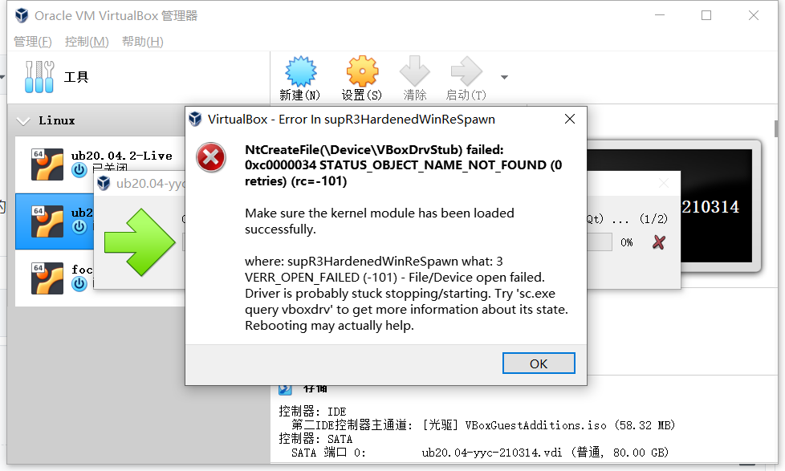
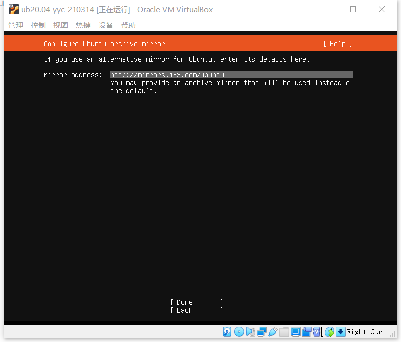
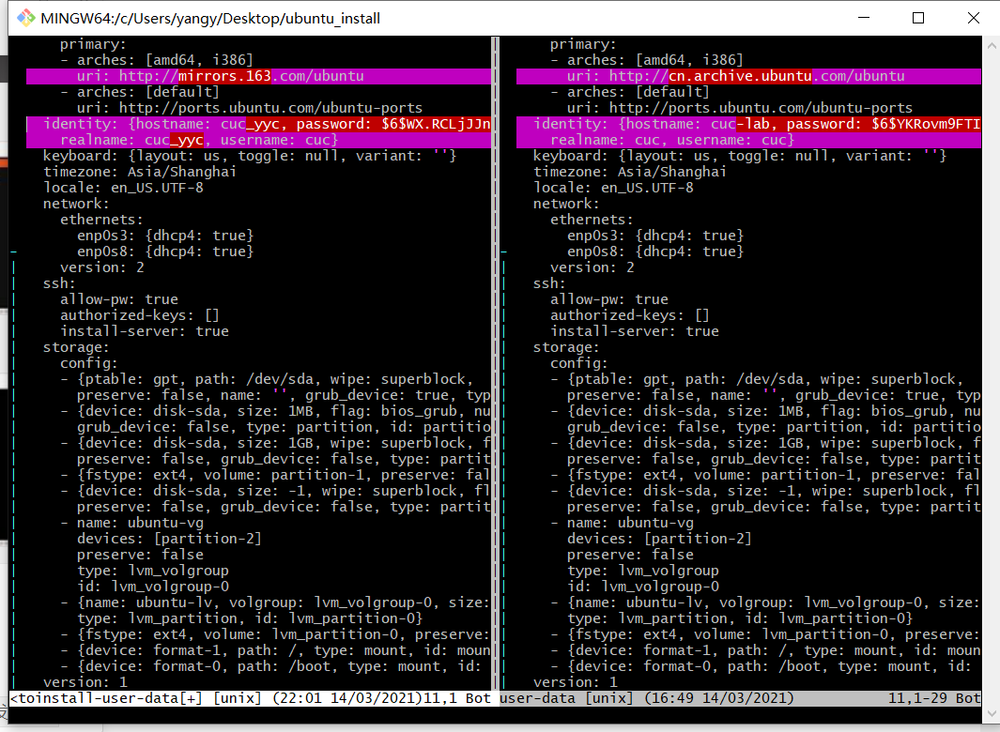
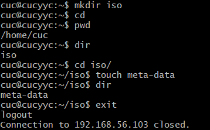
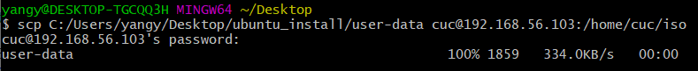
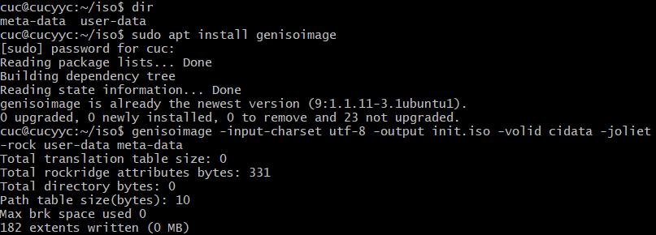
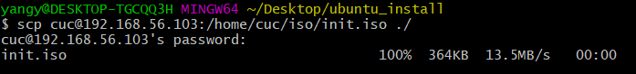
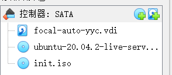
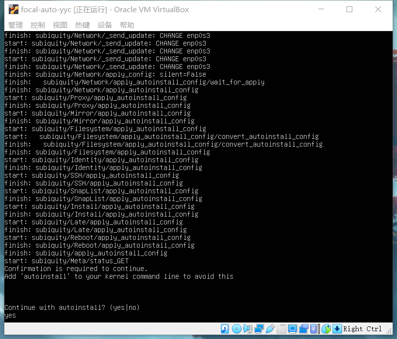
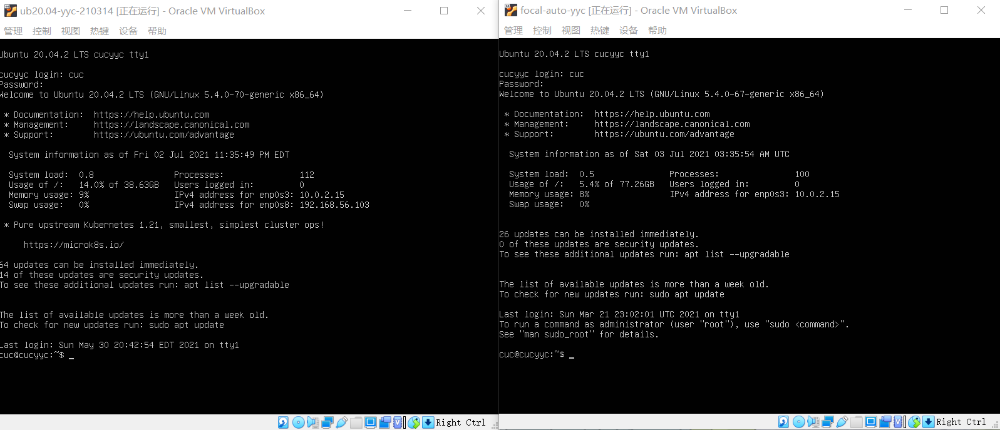

#无人值守安装ubuntu20.04

####先贴一个报错

####提醒自己开VB的时候要用管理员身份

##实验过程

1.首先是按照默认操作手动安装ubuntu20.04

由于默认源的下载速度比较慢，更换了网易的镜像源

2.通过`sudo chown cuc:cuc /var/log/installer/autoinstall-user-data`修改文件归属，再在宿主机上使用`scp cuc@192.168.56.103:/var/log/installer/autoinstall-user-data ./`将自动安装文件拷贝到宿主机（过程未截图）

3.用`vimdiff`在bash中对照[Ubuntu 20.04 + Autoinstall + VirtualBox](https://gist.github.com/bitsandbooks/6e73ec61a44d9e17e1c21b3b8a0a9d4c)中提供的示例配置文件进行修改（实战中是对着老师给的user-data进行的修改）

4.回到虚拟机中，建立新目录iso和空文件meta-data
 
 

5.将第三步制作好的user-data传输回虚拟机中 

6.在虚拟机中通过genisoimage制作init.iso文件

7.将制作好的自动安装文件传回宿主机中

8.按照顺序挂载镜像文件和init.iso

9.启动虚拟机，稍等片刻后看到命令行中出现提示信息"Continue with autoinstall? (yes|no)"，输入yes并按下回车键，就可以自动完成系统安装并重启进入系统可用状态了

##实验结果

####（实验很早就做了，报告写的比较晚，有些步骤不太记得了）