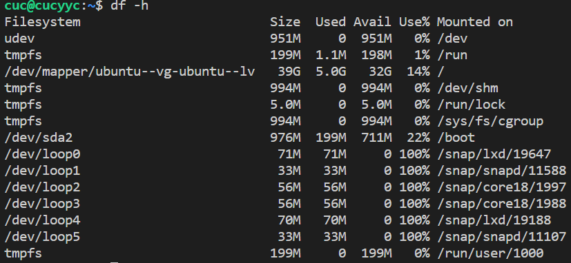
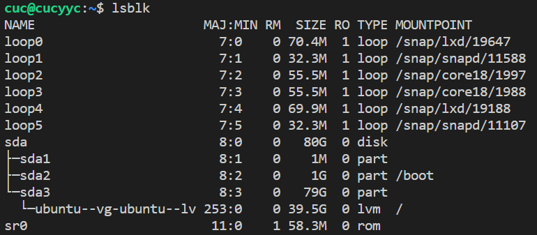
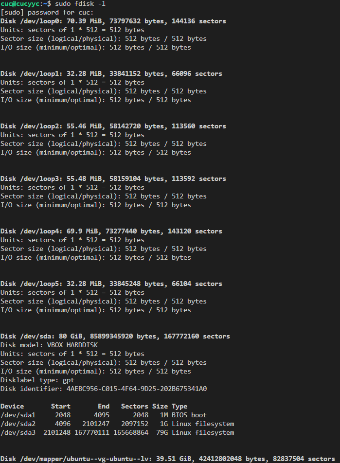

## 3.1

无法录制

## 3.2

[](https://asciinema.org/a/409784)

## 3.3

[](https://asciinema.org/a/409786)

## 3.4

[](https://asciinema.org/a/409788)

### （不知道怎么还原）

## 3.5

[](https://asciinema.org/a/409790)

### （还好不能改）

## 3.6

[](https://asciinema.org/a/409792)

## 4.1

[](https://asciinema.org/a/409793)

## 4.2

[](https://asciinema.org/a/409797)

## 4.3

[](https://asciinema.org/a/409799)

## 4.4

[](https://asciinema.org/a/409800)

## 5.2

[](https://asciinema.org/a/409803)

## 5.3

[](https://asciinema.org/a/409805)

## 6

[](https://asciinema.org/a/409806)

## 7

[](https://asciinema.org/a/409808)

## 实战

[](https://asciinema.org/a/409811)

## 自查清单

### 1、如何添加一个用户并使其具备sudo执行程序的权限？

1. 添加用户：`sudo adduser xxx`
2. 将新添加的用户加入sudo组`sudo usermod -G sudo -a XXX`

### 2、如何将一个用户添加到一个用户组？

	sudo usermod -a -G xxx group_name

### 3、如何查看当前系统的分区表和文件系统详细信息？

1.`df -h`:df命令是用来查看已挂载的文件系统磁盘空间使用量的。



2.`lsblk`:lsblk命令是用来查看块设备的。可查看未挂载文件系统的分区。



3.`fdisk -l`:fdisk是一个用来格式化硬盘、分区等的分区表操纵工具，可以用来打印硬盘信息



### 4、如何实现开机自动挂载Virtualbox的共享目录分区

1. 在windows下创建一个共享文件夹
2. 配置共享文件夹（不点击自动挂载）
3. 在虚拟机中新建共享文件夹 /mnt/dirname
4. 执行挂载命令 ```sudo mount -t vboxsf [Windows共享文件夹名称] /mnt/dirname```
    - 在进行这一步时出席挂载错误“mount: /mnt/xxx: wrong fs type, bad option, bad superblock on xxx...”，执行```sudo apt-get install virtualbox-guest-utils```即可
5. 修改 /etc/fstab 文件 在文末添加```[Windows共享文件夹名称] /mnt/dirname/ vboxsf defaults 0 0```即可完成开机自动挂载

### 5、基于LVM（逻辑分卷管理）的分区如何实现动态扩容和缩减容量？

1. 动态缩减：`lvresize --size -{{SIZE}} --resizefs {{volume_group}}/{{logical_volume}}`
2. 动态扩容：
	 - `lvresize --size +{{SIZE}} --resizefs {{volume_group}}/{{logical_volume}}`
	 - lvextend -L {{size}} XXX

### 6、如何通过systemd设置实现在网络连通时运行一个指定脚本，在网络断开时运行另一个脚本？

修改`systemd-networkd.service`配置文件

	[Service]
	...
	ExecStart=<path_service1> start
	ExecStop=<path_service2> stop
	...

### 7、如何通过systemd设置实现一个脚本在任何情况下被杀死之后会立即重新启动？实现杀不死？

服务脚本配置：
	
	[Service]
	...
	Restart=always
	...

## 参考资料
（同学作业）

[Systemd 入门教程：命令篇](http://www.ruanyifeng.com/blog/2016/03/systemd-tutorial-commands.html)

[Systemd 入门教程：实战篇](http://www.ruanyifeng.com/blog/2016/03/systemd-tutorial-part-two.html)

